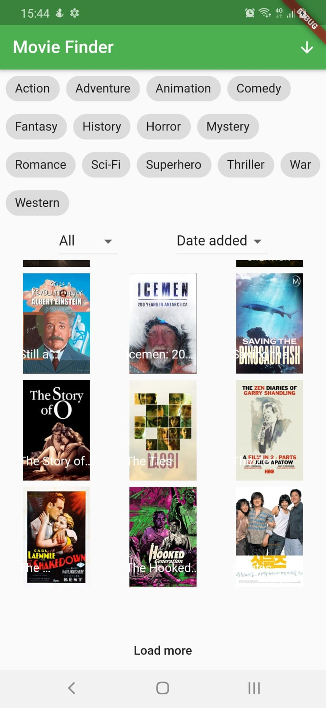
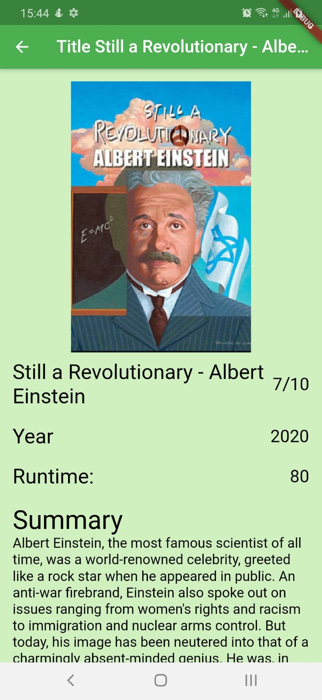

# Movie Finder Flutter Redux

This is a simple movie finder app made with Flutter and implementing the flutter redux for state management.

## Application screens

For help getting started with Flutter, view
[online documentation](https://flutter.dev/docs), which offers tutorials,
samples, guidance on mobile development, and a full API reference.
